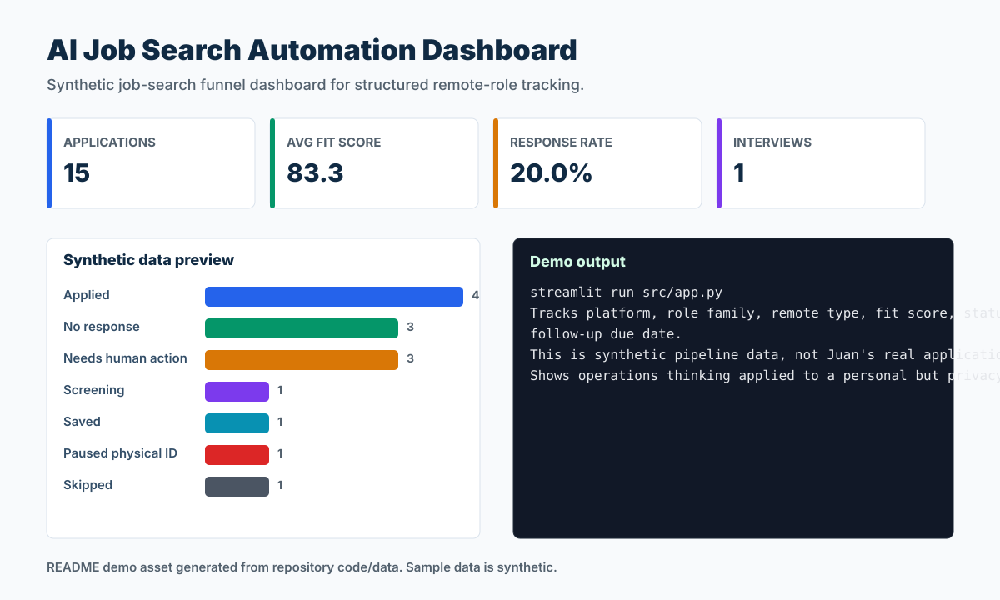

# AI Job Search Automation Dashboard

> A synthetic job-search operations dashboard for tracking remote AI/data applications.



## Recruiter Snapshot

| 30-second question | Answer |
| --- | --- |
| Problem | Job-search operations can become messy without a visible funnel, follow-up cadence, and fit criteria. |
| My role | I translated a personal workflow into a privacy-safe synthetic dashboard, defined the fields, built the Streamlit app, and documented the non-real-data boundary. |
| Result | The demo tracks 15 synthetic applications with average fit score 83.3, response rate 20.0%, and one interview-status row. |
| Portfolio signal | Shows initiative, operations discipline, and automation thinking while protecting real job-search data. |
| Data policy | All records are synthetic and safe for a public portfolio. |

## What I Built

- Role-family filter and KPI cards.
- Status funnel and applications-over-time chart.
- Pipeline table with follow-up due date, readiness, remote type, and keyword tags.

## Evidence In This Repo

- `src/app.py` contains the Streamlit dashboard.
- `data/sample_synthetic_data.csv` contains synthetic application rows.
- `assets/demo.svg` gives a GitHub-ready preview.

## Tools And Concepts

`Python`, `pandas`, `Streamlit`, `funnel analytics`, `automation thinking`, `job-search ops`

## Run Locally

```bash
python -m venv .venv
.venv\Scripts\activate
python -m pip install -r requirements.txt
streamlit run src/app.py
```

## Limitations

The data is not my real application history. It is a synthetic operating model for a dashboard idea.

## Next Iteration

- Add saved filters for remote bilingual AI/data roles.
- Add reminder logic for follow-up dates.
- Add export to CSV or Google Sheets.

## Data Privacy

Every record, identifier, organization, person, scenario, and result in this project is synthetic unless explicitly marked otherwise. No employer, client, university, colleague, customer, credential, private path, or sensitive personal record is used.
